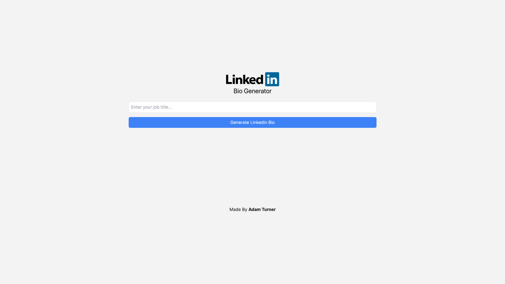

# Linkedin Bio Generator

This is a [Next.js](https://nextjs.org/) TypeScript project that integrates with OpenAI's [ChatGPT API](https://openai.com/blog/introducing-chatgpt-and-whisper-apis) to produce a humorous recommendation of a Linkedin Bio based on the user's input job title.

The project was bootstrapped with [`create-next-app`](https://github.com/vercel/next.js/tree/canary/packages/create-next-app) and styled with Tailwind CSS. It utilises server side rendering via Next.js API routes to protect the API key.

# Preview



# Live Website

You can view this portfolio in its most up-to-date form at [https://adamrichardturner.dev](https://adamrichardturner.dev)

## Getting Started

Register for an API key with OpenAI's [ChatGPT API](https://openai.com/blog/introducing-chatgpt-and-whisper-apis) and ensure you have sufficient credits in your quota.

In the project root directory store a **.env.local** file and save within it your ChatGPT API key as follows:

```bash
OPENAI_API_KEY="PUT_KEY_HERE"
```

Run the development server:

```bash
npm run dev
# or
yarn dev
# or
pnpm dev
# or
bun dev
```

Open [http://localhost:3000](http://localhost:3000) with your browser to see the result.

You can start editing the page by modifying `app/page.tsx`. The page auto-updates as you edit the file.

This project uses [`next/font`](https://nextjs.org/docs/basic-features/font-optimization) to automatically optimize and load Inter, a custom Google Font.

## Learn More

To learn more about Next.js, take a look at the following resources:

- [Next.js Documentation](https://nextjs.org/docs) - learn about Next.js features and API.
- [Learn Next.js](https://nextjs.org/learn) - an interactive Next.js tutorial.

You can check out [the Next.js GitHub repository](https://github.com/vercel/next.js/) - your feedback and contributions are welcome!

## Deploy on Vercel

The easiest way to deploy your Next.js app is to use the [Vercel Platform](https://vercel.com/new?utm_medium=default-template&filter=next.js&utm_source=create-next-app&utm_campaign=create-next-app-readme) from the creators of Next.js.

Check out our [Next.js deployment documentation](https://nextjs.org/docs/deployment) for more details.
